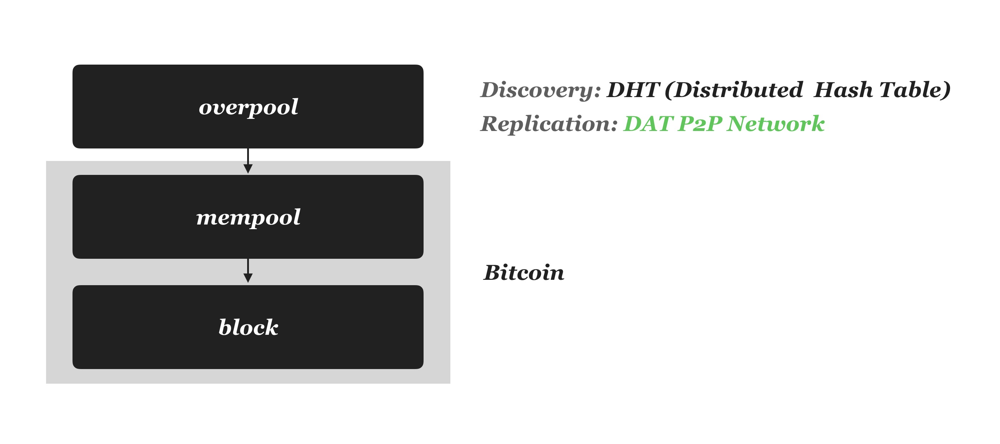
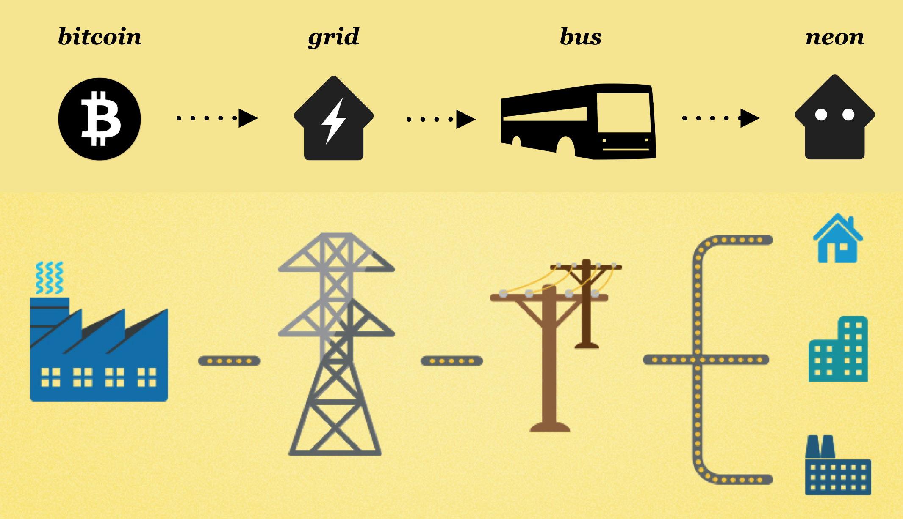
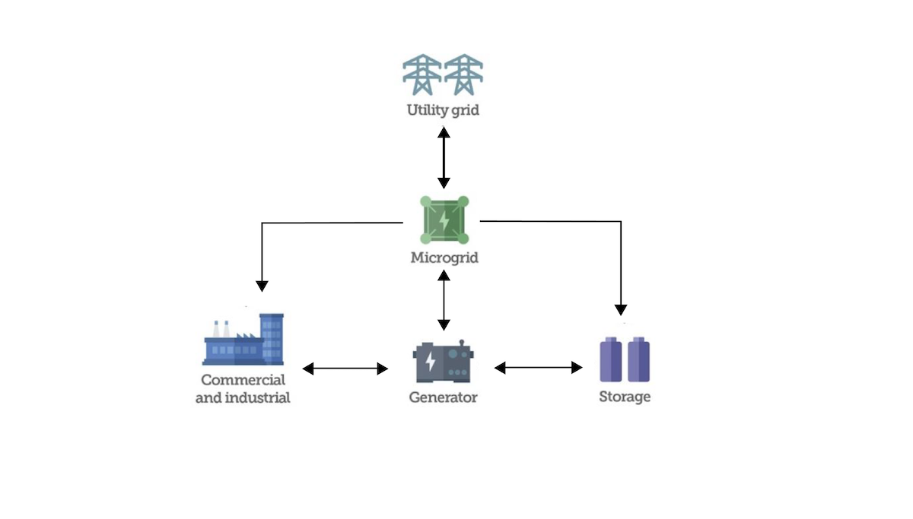
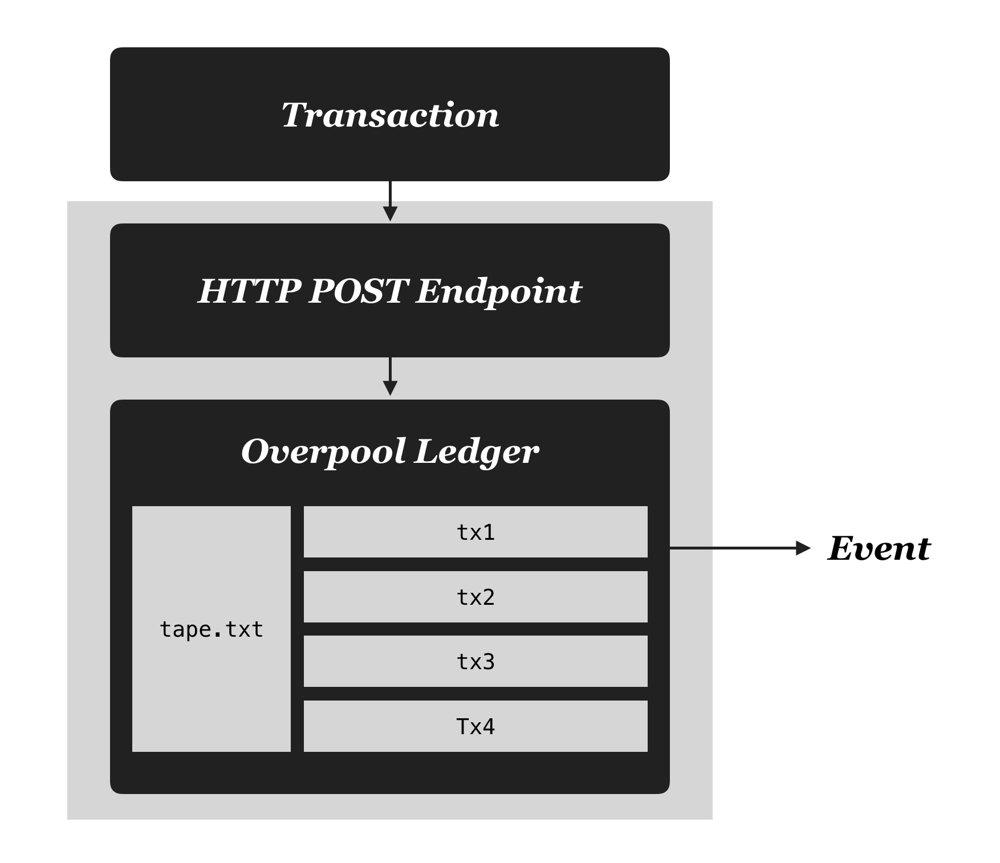
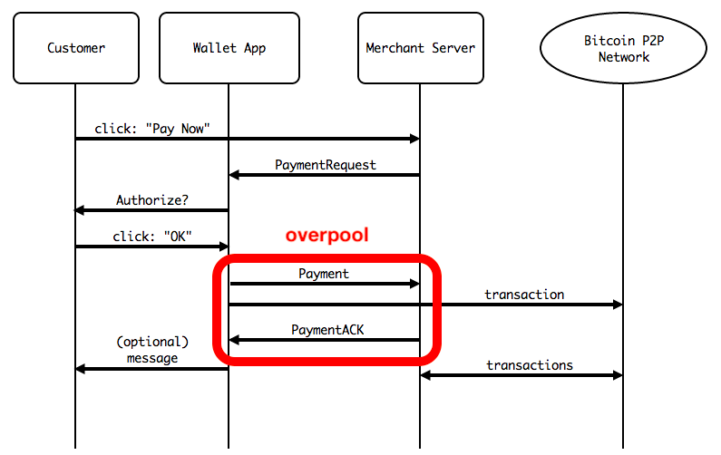
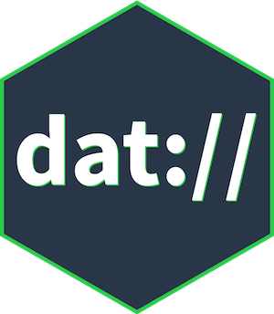
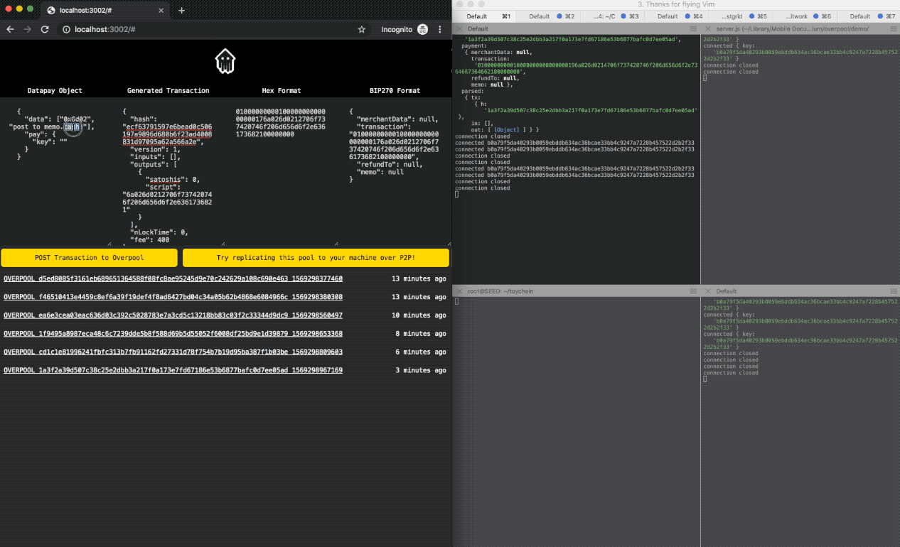
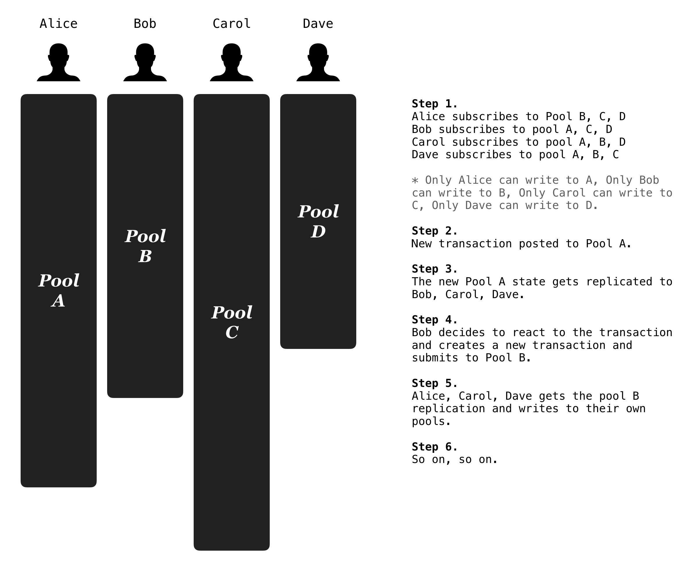

# Overpool

> A Turing-complete Decentralized Ledger of Offchain Bitcoin Transactions


## 1. Introduction



Overpool lets you build your own **off-chain bitcoin transaction ledger**, which can optionally be shared over an overlay P2P network (DAT), in realtime.

With Overpool, you can effortlessly set up an HTTP endpoint which:

1. accepts **signed OR unsigned** transactions from your users
2. creates an offchain timestamped ledger
3. which can be optionally shared over [DAT P2P network](https://dat.foundation/) to pass around transactions between peers in a decentralized manner BEFORE broadcasting.

The API is very simple and easy to use. To create a private local pool, this is all you need:

```
const Overpool = require('overpool')
const pool = new Overpool()
pool.create({ path: "mypool" })	// create a pool ledger at path "overpool/mypool"
pool.on("tx", (e) => {
  console.log("new payment", e)	// listen to realtime events from the ledger.
})
```

The file-based ledger not only provides traceability but also lets you feed directly into a state machine framework such as [Neon Planaria](https://neon.planaria.network). 

 **When combined with [Neon Planaria](https://neon.planaria.network), Overpool [becomes a Turing Complete System](#_6-turing-complete-ledger).**


This feature will soon be supported natively in Neon Planaria, but even without using Neon Planaria, you can build a Turing complete system just from the Overpool ledger.

Here we create a pool named `loop` which counts up to 100. Once you run this program, you'll see that it populates the Overpool ledger with 100 transactions, each of which is constructed iteratively from its preceding transaction.

```
const Overpool = require("overpool")
const datapay = require('datapay');
const pool = new Overpool();
var counter = 0;
(async () => {
  await pool.create({ path: "loop" })
  pool.on("tx", (e) => {
    let pushdata = e.parsed.out[0].tape[1].cell.map((c) => {
      return c.s
    })
    console.log("LOOP #"+counter, pushdata)
    counter++;
    if (counter <= 100) {
      let newpushdata = pushdata.concat(counter.toString())
      datapay.build({ data: newpushdata }, (err, tx) => {
        e.payment.transaction = tx.toString();
        pool.post({ path: "loop", payment: e.payment })
      });
    }
  })
})();
```

  This pool can also be published to the DAT P2P network which allows other developers to take advantage of the ledger as well.


## 2. The 3rd State of Bitcoin

Overpool can be used to pass around transactions before they are broadcasted and/or confirmed on the blockchain. You can:

1. Create a "3rd state" which comes before mempool. You can build your state machine (such as [Neon Planaria](https://neon.planaria.network)) without waiting for the broadcast.
2. Modify the submitted transactions and broadcast to the blockchain.
3. Modify the submitted transaction and RE-submit to the pool. This becomes interesting as [other users or peer applications may pick up the new transaction and modify and rebroadcast again](#_7-p2p-multiplayer-ledger). 
4. Store an unsigned transaction on your Overpool ledger, and let someone else sign and broadcast for you.
5. Store an unsigned transaction on your Overpool, sign it yourself and broadcast on behalf of your users.
6. Many more...

However, Overpool should not be treated as if it's the true ledger. Bitcoin is the only ledger that matters at the end of the day. Until the transactions actually end up on the ledger, it didn't happen. **You can treat Overpool like an interim state which comes before Mempool.** There are many flexible ways to use Overpool to implement powerful and instant applications, but just remember, the blockchain is always the single source of truth.


## 3. Portable File-based Design

Overpool exist as flat files. And the ledger adopts the [tape.txt](https://neon.planaria.network/#/?id=how-it-works) protocol, which makes it compatible with [Bitbus](https://bitbus.network) and [Neon Planaria](https://neon.planaria.network). You can read the ledger over and over just like you read from Bitbus and construct the same state machine deterministically.

Overpool doesn't have any restrictions. You may broadcast the transactions immediately, or you may keep them on your ledger without broadcasting, just to batch-broadcast later. Or broadcast ONLY when certain conditions are met. Also you may accept not just signed transactions but also unsigned transactions.

Finally, Overpool nodes can optionally share their pools over DHT (Distributed Hash Table), forming a global decentralized overlay network of pre-broadcast Bitcoin transactions.

Overpool is a part of the larger Bitcoin data grid system which includes [Bitbus](https://bitbus.network), [Grid Planaria](https://grid.planaria.network), and [Neon Planaria](https://neon.planaria.network).


## 4. Feature Overview

Here are the highlights:

1. **Completely Open and Decentralized:** Overpool is an **MIT Licensed open source project** which you can instantly integrate into your Bitcoin apps. And on top of that, it goes even further to let you completely open up your ledger for total interoperability and transparency through [DAT](https://dat.foundation/), a decentralized data replication protocol.
2. **Pre-broadcast Transaction Storage:** Store pre-broadcast Bitcoin transactions to your own file based ledger, on your own machine.
3. **BIP270:** Supports  [BIP270](https://github.com/moneybutton/bips/blob/master/bip-0270.mediawiki) (Implements the `Payment` and the `PaymentACK`). Instead of trying to implement a whole monolithic stack, Overpool stays minimal, which makes it effortless to blend into rest of the ecosystem products and services such as wallets.
4. **Passing around Transactions:** In addition to BIP270 which is all about signed transactions, overpool also lets you even store and pass around **unsigned** transactions. There are many things you can do with unsigned transactions. For example, you can sign transactions with your own keys on behalf of your users, which lets you build **zero-friction apps** such as [Bitchat](https://github.com/unwriter/bitchat), and in extreme cases, apps may even pay users to use their apps, implementing **negative-friction apps**. All effortlessly possible with Overpool.
5. **Filter:** Overpool also lets you filter transactions to reject those that don't fit your criteria. For example, you may choose to only accept transactions which are signed by a certain set of addresses, or if they follow a certain pattern. The filter function deserializes each transaction using [BPU](https://github.com/interplanaria/bpu) and makes it easy to process them.
6. **Traceable Transparent Ledger:** Keeps the full history of all submitted transactions on its own append-only ledger called `tape.txt` in order to provide accountability, as well as transparency when published to a decentralized network.
7. **Turing Complete Ledger:** The "tape" data structure is compatible with [Bitbus](https://bitbus.network), which means Overpool can easily plug into [Neon Planaria](https://neon.planaria.network) along with Bitbus. In addition to `onmempool` and `onblock` events, you also get `onoverpool`. (coming soon)
8. **P2P Multiplayer Ledger:** Lets you open up your local ledger to the world over DHT in a decentralized manner (Using [DAT](https://dat.foundation/)), providing global interoperability with other applications.


---


# Building a Bitcoin Data Grid

The goal of this section is to explain how Overpool intends to fit into the existing ecosystem. Using an electric grid analogy, there are two opposite approaches.

1. The top down grid
2. The bottom up Microgrid


## 1. Bitbus: Central Grid

A quick intro to what a "top down grid" means in this context. There are two "famous" on-chain states for Bitcoin:

1. **Mempool:** broadcasted to the blockchain, but not yet mined.
2. **Block:** broadcasted to the blockchain AND mined into a block.

And this is what [Grid Planaria](https://grid.planaria.network) takes care of. Its goal is to create a globally distributed Bitcoin data grid straight from the blockchain.



Making this top-down grid as economically and technologically efficient is extremely important. If this problem is not solved, the "global state" of blockchain may go away as the data get pruned out, [Fahrenheit 451](https://en.wikipedia.org/wiki/Fahrenheit_451) way, where nobody knows the entire global state, and everything becomes fragmented.

> **The Goal of Planaria corp. is to avoid the Fahrenheit 451 future.**

The goal is to make sure this top down approach is economically viable so the "global state" will be preserved in one way or another. Also, by creatinig an efficient top down replication network, we can make everything much more resilient, for example avoid the problem of Bittorrent seeders going away once a torrent loses popularity.

> **The "Central Grid" is all about "Global State"**

HOWEVER, there is another state which hasn't been explored much yet. And that is: **"What happens BEFORE broadcasting?"**.

And this is what Overpool tackles.


## 2. Overpool: Decentralized Microgrid



> **The "Microgrid" is all about "Local State"**

There have been projects which dealt with pre-broadcast transactions, such as [Bitpipe](https://github.com/unwriter/bitpipe), [Bitchat](https://github.com/unwriter/bitchat) (which uses Bitpipe) before as well as a proposal such as [Fat URI](https://github.com/unwriter/faturi). One common theme with these technologies is that they pass around transactions among multiple parties before actually broadcasting.

This is analogical to how electric microgrids work. While the "central grid" is efficient in many cases, Microgrids have their own strengths as well. Because it's self-sustainable (Overpool itself doesn't need a blockchain, it lets developers create their ledger which can combine to even create their own overlay network), the user experience is instant.

However this doesn't mean Overpool solves everything. After all, it isn't "truth" until it's written on the blockchain. And you still need to broadcast transactions to the blockchain if you want the transaction to actually get recorded. Furthermore, the "single source of truth" is always the blockchain itself. Also, developers who want to build an aggregation application or need a more holistic view of the blockchain need the "Central grid".

So how does Overpool exactly fit into the larger "Grid"? It's designed to blend into existing Bitcoin ecosystem infrastructure as well as the larger Internet ecosystem.

1. Overpool follows the same [tape protocol](https://neon.planaria.network/#/?id=how-it-works) implemented by other frameworks and systems such as [Bitbus](htttps://bitbus.network), [Neon Planaria](https://neon.planaria.network), and [Grid Planaria](https://grid.planaria.network). By adopting the uniform interface everything can work in concert and create synergy.
2. Overpool is compatible with [BIP270](https://github.com/moneybutton/bips/blob/master/bip-0270.mediawiki), and in fact even more generic (It not only supports signed transactions as suggested by BIP270, but also lets you store even unsigned transactions).
3. Most importantly, Overpool lets you publish the pool on a DHT (Distributed Hash Table) over [DAT](https://dat.foundation/) protocol, which can be used to create a global decentralized overlay network of **PRE-BROADCAST Bitcoin Transactions**.


## 3. Grid + Microgrid => Resilient + Efficient

If [Bitbus](https://bitbus.network) is a [top-down Bitcoin data grid](https://grid.planaria.network/#/?id=roadmap), Overpool is a bottom-up [Microgrid](https://en.wikipedia.org/wiki/Microgrid). 

**If Bitbus is all about global state, Overpool is all about local state.**

Both have their own strengths and you can use them together to build powerful and efficient apps.

For example, in [Neon Planaria](https://neon.planaria.network) you will soon be able to process Overpool events to implement apps that react instantly to user requests, but at the same time use the `onmempool` or `onblock` events from Bitbus to get the actual events that exist ON the blockchain and get a holistic view.

You may create your own **"local tentative state"** which exists before you broadcast the transaction to the blockchain and see it in the mempool. It lets you build extremely flexible apps where you may create a state machine out of transactions which have not even been broadcasted, and later update the state again when it's finally broadcasted and mined into a block, by listening to [Bitbus](https://bitbus.network).

The point is that developers have options to mix and match what makes most sense to them, creating synergy.

---


# Features

## 1. Pre-broadcast Transaction Storage

In the most basic form, Overpool is simply a Microservice endpoint which lets users submit **signed** or **unsigned** Bitcoin transactions over HTTP and store them on a file based ledger.



These properties give us a lot of room for further extension and much more powerful integration into other systems in the Bitcoin ecosystem. For example, the "ledger" follows the same `tape.txt` format as [Bitbus](https://bitbus.network) and [Grid Planaria](https://grid.planaria.network), which means it's instantly [Neon Planaria](https://neon.planaria.network) compatible. Also, it follows the BIP270 protocol for requesting and responding to storage, therefore easy to plug into existing wallet systems which have implemented BIP270.


## 2. BIP270

While Overpool was not designed with BIP270 specifically in mind, it has adopted the BIP270 way of doing things so that it can integrate much more frictionlessly into the existing ecosystem such as wallet providers and miners. It will further evolve to support various needs of those who work with BIP270.

Here's where Overpool fits into within the BIP270 workflow:




Overpool is deliberately minimal, and the rest of the logic can be implemented by the application developers by integrating with various wallet SDKs which implement BIP270, or you may even roll your own backend wallet system (dealing with unsigned transaction magic may require this). Also you may also plug Overpool into [Neon Planaria](https://neon.planaria.network) to not only construct a state machine, but also:

1. broadcast transactions to the network, through libraries such as [BSV](https://github.com/moneybutton/bsv) or [Datapay](https://github.com/unwriter/datapay)
2. modify (for example signing with a key, or updating payload) and resubmit the transaction back to Overpool, which kicks off another cycle.


## 3. Pass around transactions

Passing around transaction before broadcasting can be really powerful but the idea has not been explored much. Here are some prior arts which dealt with passing around signed or unsigned transactions:

- [Bitpipe](https://github.com/unwriter/bitpipe): A microservice for transforming, filtering, and broadcasting someone else's transaction. Similar to Overpool but ephemeral.
- [Bitchat](https://github.com/unwriter/bitchat): Realtime chatroom over Bitcoin. Used Bitpipe.
- [Eli](https://github.com/unwriter/eli): Eliza over the Bitchat network.
- [Fat URI](https://github.com/unwriter/faturi): A new type of URI scheme to pass around signed or unsigned transactions between multiple devices.
- [ButtonPage](https://button.bitdb.network/): Store transactions in a base64 URI and share the page.
- [Bitbtn](https://bitsent.net/bitbtn.html): A button that creates cross-platform deep URIs.

One common theme is that all these ideas and projects were ephemeral. Overpool takes one step further and makes this persistent. It creates a ledger out of these transactions. By creating a ledger, it can achieve all the same benefits but much more powerful because asynchronous function calls and deterministic looping becomes possible.

Furthermore, it even allows for creating an overlay P2P network for sharing the pool in a decentralized manner.

**It's worth noting again that Overpool is not just about signed transactions. It also supports unsigned transactions.** 

So why would anyone want to store unsigned transactions? There are many things you can do with it. For example, application developers can sign transactions with their own keys on behalf of their users, on their own server, which lets them build **zero-friction apps** such as [Bitchat](https://github.com/unwriter/bitchat), and in extreme cases, apps may even pay users to use their apps, implementing **negative-friction apps**.


## 4. Filter

By default, Overpool accepts all types of transactions as long as they are formatted correctly. It even accepts unsigned transactions. However, you can add a filter if you want to control which transactions get through and get written on the overpool ledger.

For example, to only accept signed transactions, you may write the following code, where it checks that the input is not empty.

```
const Overpool = require('overpool')
const pool = new Overpool()
pool.create({
  path: "localhost",
  filter: (e, callback) => {
    /******************************************
    *
    *  The "parsed" attribute contains a BPU parsed transaction object.
    *
    *  e := {
    *    merchantData: null,
    *    transaction: '0100000000010000000000000000296a2231394878696756345179427633744870515663554551797131707a5a56646f417574046173666400000000',
    *    refundTo: null,
    *    memo: null,
    *    parsed: {
    *      tx: {
    *        h: 'da19359e5e91ce7962cf42a885e0dc4c5c7a3a66823637caf15002d422d8f77d'
    *      },
    *      in: [],
    *      out: [ [Object] ]
    *    }
    *  }
    *
    ********************************************/
    if (e.parsed.in.length > 0) {
      callback(null, true);
    } else {
      callback("must have inputs")
    }
  }
})
```

As you can see, you can set the filter when you create a pool. Simply pass a filter function as the second argument.

The callback takes two arguments. When you want to reject, just make sure the first argument is not null. When you want to pass through, simply set the first argument to null, and pass `true` for the second argument.


## 5. File based ledger

**By default, Overpool is your own local ledger.** Instead of firing and forgetting events, it creates a light-weight, traceable, replicable file-based ledger on your machine, which you can replay as many times as you want to construct a state machine or run any processing logic.

1. **Replayability:** You can replay the ledger over and over to construct your own state machine, using [Neon Planaria](https://neon.planaria.network). Basically you can think of Overpool as a client-side approach to [Bitbus](https://bitbus.network).
2. **Cross-language & Cross-platform:** Storing the ledger as a flat file enables any programming language to process the ledger in realtime. You just need to tail the `tape.txt` file and run the logic accordingly.
3. **Replicability:** Files are easy to replicate, for example over a peer to peer network such as [DAT](https://dat.foundation/).
4. **Accountability:** Since Overpool is its own ledger which timestamps every submitted transaction, it lets developers provide transparency for their systems. By making the Overpool public and allowing anyone to synchronize from your Overpool ledger in a P2P manner, you can truly provide transparency since your users and other developers can instantly replicate the Overpool ledger in realtime, signed by your Overpool private key (This is NOT bitcoin private key, but the key for the Overpool ledger, which is powered by [DAT protocol]([https://dat.foundation](https://dat.foundation/)))


## 6. Turing Complete Bitcoin

The Overpool ledger has the same data structure as the [Bitbus](https://bitbus.network) ledger, which means it can easily plug into [Neon Planaria](https://neon.planaria.network). It's just another way of powering Neon Planaria (Coming very soon).

The code will look like:

```
const { planaria } = require("neonplanaria")
planaria.start({
  ...
  onoverpool: async function(e) {
    /***********************************************
    
    	# overpool handler
    	Here you can process Overpool events just like
    	the rest of the event handlers!
    
    ************************************************/
  },
  onmempool: async function(e) {
    ...
  },
  onblock: async function(e) {
    ...
  },
  onstart: function(e) {
    ...
  },
})

```

Combining Neon Planaria with Overpool, you now have options to not only create your state machine, but also create states themselves through:

1. **Looping:** Loop as many times as you want by resubmitting transactions to Overpool from `onoverpool` handler.
2. **Committing:** Broadcast to Bitcoin inside `onoverpool` once you're ready to commit.

Here's an example of Looping:


Basically, you write a neon planaria logic for `onoverpool` which creates another transaction and submits to Overpool. This triggers another `onoverpool` and you can keep going like this to implement looping in Bitcoin.

It's important to note that the state is not final until the final state is broadcasted to Bitcoin. To make a commitment, you simply broadcast the final transaction. Here's how it would work:


Here's what the actual program would look like:

1. You write `onoverpool` handler to determine whether the new transaction event from Overpool should be ignored, looped, or committed to Bitcoin.
2. If it needs to loop, you update the transaction by modifying it inside `onoverpool` and make a [pool.post()](#_6-post) request to your Overpool endpoint with the new payload.
3. This will result in your Overpool ledger incrementing and will trigger another event.
4. You can then run the same logic and decide whether to loop, ignore, or commit.
5. When it's time to commit, you can broadcast the final transaction to the Bitcoin network inside `onoverpool` using libraries like [BSV](https://github.com/moneybutton/bsv) or [Datapay](https://github.com/unwriter/datapay).
6. Additionally, you could update your own Neon Planaria state machine during all this. Thanks to Neon Planaria being highly flexible, you can program the state machine in any way you want.


## 7. P2P Multiplayer Ledger

Overpool utilizes [DAT](https://dat.foundation/) protocol to allow each service to share their user transaction pool in a decentralized manner using [Distributed Hash Table](https://en.wikipedia.org/wiki/Distributed_hash_table).



Developers may decide to keep their pool private, but also may want to publish their pool, opening up their pool to the world to let anyone subscribe to the pool and act upon events in realtime.

Here's an example of submitting a transaction to an Overpool endpoint through a web app, and multiple peers (Top right and bottom right) instantly synchronizing to the publisher pool (Top left corner)



The idea is that, instead of simply storing the files locally, the developers and businesses should find it more beneficial to share their pre-broadcast transaction pools with the rest of the world, which will create synergy with other apps and therefore create more value. For example, think of the following scenario:

1. Alice and Bob both run the same application protocol.
2. Alice has her own public Overpool A.
3. Bob has his own public Overpool B.
4. Alice is subscribed to Bob's Overpool B, and Bob is subscribed to Alice's Overpool A.
5. When Alice detects certain transaction on B, she posts a transaction to her A.
6. Because Bob is also listening to A, Bob can also react to it and create another transaction and post to his B.
7. Again, Alice is listening to B, so she can detect the transaction and create another transaction, etc.
8. All this is done in a decentralized manner over the P2P DAT protocol.

An easy way to think about this is to **view each pool as a social media feed.** Only the owner of the pool has write access, but since they can let others subscribe to their pools, it's almost like these Overpool ledgers are Twitter accounts, and applications subscribe to one another to carry out actions.

Here's a more detailed diagram:



Just to emphasize, publishing your pool may be beneficial because:

1. **Open API:** You can provide an open API endpoint for your own Overpool. With an open approach you can grow the developer ecosystem and bring in more users.
2. **Efficient API:** Since DAT allows for decentralized replication (vs. a server-client replication), the more API usage you get, the more you will save money, since everyone syncing from your Overpool will share the network traffic load.
3. **Interoperability:** You can use Overpool to allow other apps to interact with your app's local state easily.


---


# Tutorial

Let's walk through the entire process of:

1. Creating a single player pool (Default)
2. Setting a filter in order to take or reject incoming transactions
3. Publishing the pool
4. Subscribing to the published pool from another machine as a peer pool


## 0. Install

```
npm install --save overpool
```

Some recent versions of node.js have a bug that fails when you try to build. You may need to "downgrade" the node version. The following version has been confirmed to work.

```
sudo npm install -g n
sudo n 10.16.0
```

If it still fails, you may need to install some utilities:

```
sudo apt-get install autoconf libtool automake build-essential
```


## 1. Single Player Pool

The "single player pool" is the simplest of all. By default all pools are single player until you publish them. It simply creates an HTTP endpoint which allows for submitting transactions and stores them as a ledger, and that's it.

Let's first create a single player pool. Create a file named `localpool.js` with the following code:

```
const Overpool = require('overpool')
const pool = new Overpool()
pool.create({ path: "mypool" })
pool.on("tx", (e) => {
  console.log("new payment", e)
})
```

Run 

```
node localpool
```

This will create the following folder structure under the current execution directory:

```
/overpool
  /mypool
```

It also starts an HTTP endpoint at port 3000 (That's the default port. You can change it by passing `port` attribute when calling `pool.create()`).

- `POST /mypool`: Lets you submit BIP270 compliant Payment objects as payload.

The BIP270 request format looks like this:

```
{
  merchantData: <merchant data string. optional>,
  transaction: <hex-formatted signed or unsigned transaction. required>,
  refundTo <string. paymail to send a refund to. optional>,
  memo: <string. optional>
}
```

The request will immediately return a response which looks like:

```
{
  payment: <The original payment object from above. Required.>,
  memo: <string. optional>,
  error: <number. optional>
}
```

Internally, Overpool will store the submitted payment under the `overpool/mypool` folder. The result may look something like this:

```
$ ls overpool/mypool
19b6ef68da0612a8a53789a96d25e3c0eaaf0ef7f547d922a9bb5520ad74c3c9
22f7a102c826d10abe7a037409c72e45b8a34b6e94b6d8f77e1b14b324f64ebd
3320a4e95148c93d1a2dd01cc97f4225043f11b2c34a7ec710809f5a5817fb29
37e5b38fc5a5b277d3fee2617d97b96f3dc209813d439bad67602d9863432318
5d7867b9e41aaebd5786c7c44fd59b61b85823adda5971e8b9b68025cdbd9185
ad0401bea4ba3f2b5a819c74e4ea6e3c1dd82631be2a4553b25f47cef9d03eb8
d7fcc2cc5e60154e299c5464e3e6450734a4accab4d747f171e99b7dd3f58390
tape.txt
```

and when you look inside, it may look something like this:

```
$ cat overpool/localhost/d7fcc2cc5e60154e299c5464e3e6450734a4accab4d747f171e99b7dd3f58390

{"merchantData":null,"transaction":"0100000000010000000000000000136a026d020e706173646661736466617364662100000000","refundTo":null,"memo":null}
```

And inside `overpool/mypool/tape.txt`:

```
OVERPOOL 5d800a33fe8049b1315d8d2c9d42d670cd39437816fd4bf32b598203c17e3ac0 1569114405132
OVERPOOL 1155fe3d85c951c500087df48c689d9c8fb9ea772fcbd855505cf7292d48c54e 1569114407394
OVERPOOL 86738f9b6887ee0aa89b3bd8ae08874ba04e12a9740621c72b40cee255bd5194 1569114613993
OVERPOOL 46ba0a11be677f958046f310100114399a816b054becb29dc507cc8fc59a75fb 1569116732756
OVERPOOL ac59c747c541aa9ee49eedb84e5e99e08d8672e2952afe32d91339b493594853 1569116767097
OVERPOOL 12baaae782bfc43762f6db66840e492b176771f15c32fdf0624e0c29aff96375 1569116812361
OVERPOOL d7fcc2cc5e60154e299c5464e3e6450734a4accab4d747f171e99b7dd3f58390 1569117470756
OVERPOOL 6158835b0d87210599db5f8424aebab8d0f1f9040f52574c8142c96c3371421a 1569117733123
OVERPOOL 0afb61b0a01ee015fc7f9584581d09828acb2f8522de831cbac8343f648c6d53 1569117758127
OVERPOOL 5eca34d894441298b3907e2b29683679444044abe8029b568dbb9589dfe5b54e 1569117933414
OVERPOOL 2592df5cd3489650ef1f897fb981318d8d3500e8ee668add091bedafef6f2d6c 1569118085590
OVERPOOL 4c7f27a023c45a1cfa6a559902939d3dafb0f9750bdfd6d5241b33ef9cd30cc1 1569118452142
OVERPOOL b81b085adc73cd5a0e8af8d8a38fac6eba4f8170d769eb7fd88a34aa146e6ec3 1569118546460
OVERPOOL 58f25da021d721e7887f0bca314596462eb68906c5807e37be666c75cad1bef9 1569118592103
OVERPOOL 8434429e02e35d20933c657708e5093d7ee7bff5fd3660ffaf28860f4543bb34 1569119185281
OVERPOOL 38959f2ba60d7af432aa71289325d3bbd2d5951d04fc17ef7e9d27209c9cd0b2 1569119191320
```

1. Each transaction is stored as the filename `<txid>` where each file contains the full JSON payload..
2. Overpool then increments the `tape.txt` file to add a line: `OVERPOOL <txid> <unix timestamp>`.
3. Then a `pool.on("tx")` event is triggered from the file. **It's important to note that the event is not triggered directly from the HTTP request**. It's triggered by tailing the `tape.txt` file. This makes it easy to process using any programming language or on any platform. Also this property allows the pool to be replicated through the P2P DAT network.


## 2. Filtered Pool

By default, the pools accept all types of transactions as long as they are in a valid format, including unsigned transactions.

This may not be what many people want. You may want to filter the transactions before storing to the pool because otherwise you may end up with all kinds of irrelevant transactions people randomly submit. You can set a filter function which accepts or rejects an incoming transaction.

You can set the filter at the time of the pool creation. Instead of just saying `pool.create({ path: "mypool" })`, you can call `pool.create({ path: "mypool", filter: <Filter Function> })`

```
pool.create({
  path: <pool path>,
  filter: (Payment, Callback) => {
  // 1. check some condition
  // 2. call Callback(null, true) for accepting.
  // 3. call Callback(<error message>) for rejecting.
  }
})
```

Where the `Payment` is defined as:

```
{
  merchantData: <merchant data string. optional>,
  transaction: <hex-formatted signed or unsigned transaction. required>,
  refundTo <string. paymail to send a refund to. optional>,
  memo: <string. optional>,
  parsed: <transaction deserialized using BPU https://github.com/interplanaria/bpu>
}
```

Here's an example where we check if the payment contains an input, therefore rejecting all unsigned transactions.

```
const Overpool = require('overpool')
const pool = new Overpool()
pool.create({
  path: "localhost",
  filter: (p, callback) => {
    if (p.parsed.in.length > 0) {
      callback(null, true);
    } else {
      callback("must have inputs")
    }
  }
})
```


## 3. Publishing a Multiplayer pool over P2P

The default pool is already very useful as you can immediately start using it to service your own users. 

However we can go further. We can share the pool over DHT (Distributed Hash Table) and allow anyone to replicate the pool in realtime in a decentralized manner. This may be beneficial because:

1. **Open API:** You can provide an open API endpoint for your own Overpool. With an open approach you can grow the developer ecosystem and bring in more users.
2. **Create your own efficient overlay network:** Since DAT allows for decentralized replication (vs. a server-client replication), the more API usage you get, the more you will save money, since everyone syncing from your Overpool will share the network traffic load.
3. **Interoperability:** You can use Overpool to allow other apps to interact with your app easily. There may be multiple Overpools which inter-communicate with one another for the same application.

Publishing a pool is easy. Simply call `pool.publish({ path: <pool path> })` .

```
const Overpool = require('overpool')
const pool = new Overpool()
let key = await pool.create({ path: "mypool"})
console.log("The discovery key is: ", key);
await pool.pub({ path: "mypool" })
```

Notice the `pool.create` function gives us a `key` attribute. This is the public discovery key which can be used to let others connect to your pool. Running the program would print something like:

```
The discovery key is: d7fcc2cc5e60154e299c5464e3e6450734a4accab4d747f171e99b7dd3f58390
```


## 4. Subscribing to a Multiplayer Pool

### 4.1. Connecting to Peer Pool

Now that we've published our pool, let's try joining (and subscribing to) it from another machine. In this example we will take the same key we got from above public pool in order to connect to that pool.

```
const Overpool = require('overpool');
const pool = new Overpool();
await pool.sub({ path: "d7fcc2cc5e60154e299c5464e3e6450734a4accab4d747f171e99b7dd3f58390" })
```

And that's it!

You'll notice that, as soon as you run this program, your local `overpool` folder is synchronized with the remote public pool identified by the key `d7fcc2cc5e60154e299c5464e3e6450734a4accab4d747f171e99b7dd3f58390`.


### 4.2. Decentralized Event Listener

We can check that the files are being synchronized, but it would be even better if there's a built-in API which lets us process new transaction events programmatically. For this we have `pool.on()`:

```
const Overpool = require('overpool');
const pool = new Overpool();
await pool.sub({ path: "d7fcc2cc5e60154e299c5464e3e6450734a4accab4d747f171e99b7dd3f58390" })
pool.on("tx", (e) => {
  console.log("new payment", e)
})
```

Here we have introduced another method, called `pool.on()`. This lets you attach event handlers to your pool so you can process them in realtime.

**Note that this event is NOT triggered by the original HTTP request directly, but by tailing the `tape.txt` file for updates.**

This is how all replicated pools can react instantly to events even when they don't directly face the original Overpool server users. This is how a decentralized event listener is implemented.


### 4.3. A Pool of Pools

It's also worth noting that you can subscribe to as many peers as you want:

```
const Overpool = require('overpool')
const pool = new Overpool()
await pool.sub({ path: <key1> })
await pool.sub({ path: <key2> })
pool.on("tx", (e) => {
  console.log("event = ", e); // "e" will contain the originating pool identification key as well as the payload
})
```

## 5. More Examples

Try more tutorials in the repository:

### 5.1. Basic Pool

a simple single-player pool

https://github.com/interplanaria/overpool/tree/master/demo/basic

### 5.2. Filtered Pool

A pool with a request filter

https://github.com/interplanaria/overpool/tree/master/demo/filter

### 5.3. Looping with Bitcoin

Implementing a primitive looping with Bitcoin transactions

https://github.com/interplanaria/overpool/tree/master/demo/loop

### 5.4. P2P Pubsub

A demo for Overpool pubsub over DAT P2P Network

https://github.com/interplanaria/overpool/tree/master/demo/pubsub


---


# Install

```
npm install --save overpool
```

Some recent versions of node.js have a bug that fails when you try to build. You may need to "downgrade" node version for now.

```
sudo npm install -g n
sudo n 10.16.0
```

---


# API

There is one constructor and 6 API methods


## 1. constructor

```
const overpool = require('overpool');
const pool = new overpool()
```


## 2. create

You can create your local pool using `create()`. `create` is an async function.

- **path:** The relative path under `overpool` folder to store the current pool.
- **port:** if unspecified, the default is 3000.

```
let discoveryKey = await pool.create({
  path: <relative path under the overpool folder to store the current ledger>,
  port: <HTTP port at which to accept transactions>,
  filter: <Filter function>
})
```

For example, the following creates the overpool ledger under `overpool/localhost` folder, and starts an HTTP endpoint at port 3000.

```
let discoveryKey = await pool.create({
  path: "localhost",
  port: 3000
})
```

Also, if you want to add a filter which will let you accept or reject transactions based on its patterns, here's an example:

```
const Overpool = require('overpool')
const pool = new Overpool()
await pool.create({
  path: "localhost",
  filter: (p, callback) => {
    if (p.parsed.in.length > 0) {
      callback(null, true);
    } else {
      callback("must have inputs")
    }
  }
})
```


## 3. pub

To publish the overpool, call `pub()`. This is optional. If you want to just keep the pool private, just don't call pub.

```
await pool.create({
  path: <the path to store the overpool ledger>,
  port: <HTTP port at which to accept transactions>
})
let discoveryKey = await pool.pub({
  path: <the path to publish>
})
```

For example,

```
await pool.create({
  path: "localhost",
  port: 3000
})
let discoveryKey = await pool.pub ({ path: "localhost" });
```


## 4. sub

Subscribe to a peer Overpool. This applys only when you have a discovery key someone shared after publishing their Overpool.

```
await pool.sub({ path: <discovery key> })
// do something here
```


## 5. on

You can listen to events on your ledger using the `pool.on()` event handler.

```
pool.on("tx", (e) => {
  /******************************************************************
    e := {
      key: <public|localhost|remote peer discovery key>,
      hash: <transaction id>,
      payment: <the payment object stored in the corresponding file>
    }
  *******************************************************************/
})
```

Here's a full example where we start a public pool and immediately start listening to events.

```
const Overpool = require('overpool');
const pool = new Overpool();
let key = await pool.create({ path: "demo" })
pool.on("tx", (e) => {
  console.log("overpool event = ", e);
})
```

And here's an example where we start listening to a remote peer pool and act accordingly:

```
const Overpool = require('overpool');
const pool = new Overpool();
let key = await pool.sub({
  path: "d7fcc2cc5e60154e299c5464e3e6450734a4accab4d747f171e99b7dd3f58390"
})
console.log("subscribed to", key);
pool.on("tx", (e) => {
  console.log("remote peer overpool event = ", e);
})
```


## 6. post

You can directly post to your own ledger without going through HTTP. 

> **NOTE 1: You can only post to your own pool. If you subscribe to a pool you can only read.**

> NOTE 2: In order to implement asynchronous multiplayer pool dynamic, you may want to create your own pool and let the other party subscribe to your own pool. Alice writes to Alice pool, Bob subscribes to Alice pool, but only writes to Bob pool. Alice and Bob communicates by each writing to their own pool and subscribing to each other's pool. 

The syntax is:

```
const Overpool = require('overpool');
const pool = new Overpool();
await pool.create({ path: "loop" })
await pool.post({
  path: "loop",
  payment: <Payment object>
})
```

You can implement a looping program if you use this API along with the `on()` event handler. For example, you can listen to `on("tx")` event and create a new entry on the overpool ledger. This will trigger another event, and you may also write a logic to automatically trigger another transaction, etc. until it meets certain condition and halts (and you can broadcast transactions at any point in time during the entire looping process).


## 7. prune

prune the `tape.txt` file.

Pruning involves renaming `tape.txt` to `tape-<timestamp>.txt` and creating a new `tape.txt` file to start the logging all over again.

```
await pool.prune("mypool")
```
