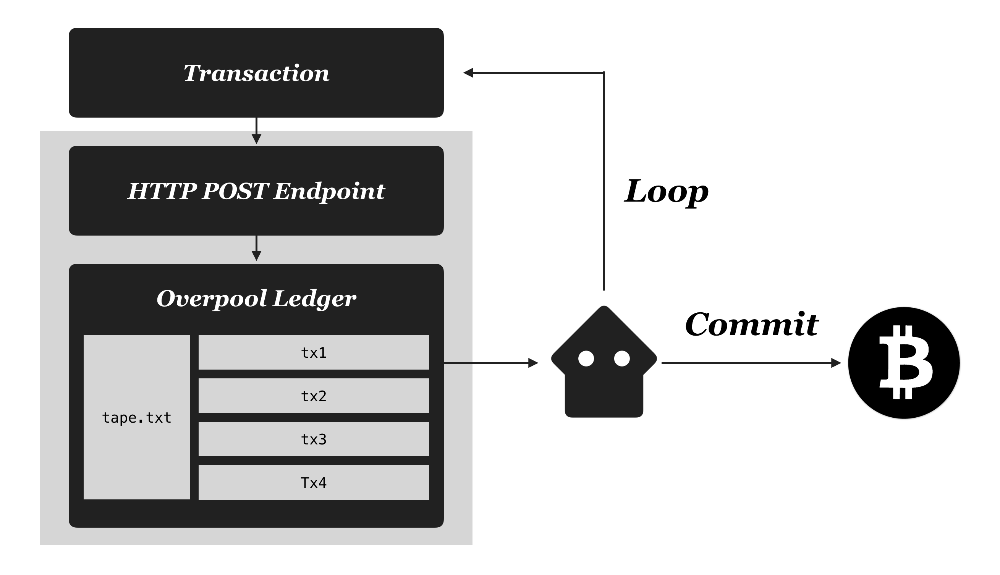

# Looping with Bitcoin

In this example, we are going to loop exactly 100 times to update the transactions iteratively.


First, start the overpool server. This will create a pool named "loop" under `overpool/loop`.

```
node server
```

Then run the client:

```
node client
```

If you look into the client code, you'll see that all it does is create an initial datapay transaction with `["1"]` as seed, trigger the chain reaction by posting once.

Then if we look at the server code, you can see that we are listening to `pool.on("tx")`.

It extracts out the pushdata sequence first.

```
pool.on("tx", (e) => {
  let pushdata = e.parsed.out[0].tape[1].cell.map((c) => {
    return c.s
  })
  ...
```

Then it increments the counter and concatenates the counter to the end of the previous pushdata sequence (And only do it until the counter reaches 100):

```
counter++;
if (counter <= 100) {
  let newpushdata = pushdata.concat(counter.toString())
  ...
```

Then it builds a new transaction using `datapay.build()`, and the posts the transaction to Overpool, kicking off the next loop.

```
datapay.build({ data: newpushdata }, (err, tx) => {
  e.payment.transaction = tx.toString();
  pool.post({
    path: "loop",
    payment: e.payment
  })
});
```

While the example ends here, 

we can easily imagine a scenario where we broadcast the transaction at the end of the 100th loop instead of posting to Overpool. 



For example:

```
if (counter <= 100) {
  let newpushdata = pushdata.concat(counter.toString())
  datapay.build({ data: newpushdata }, (err, tx) => {
    e.payment.transaction = tx.toString();
    pool.post({
      path: "loop",
      payment: e.payment
    })
  });
} else {
  datapay.send({ data: pushdata }, (err, tx) => {
    console.log("Broadcasted!", tx)
  });
}
```
